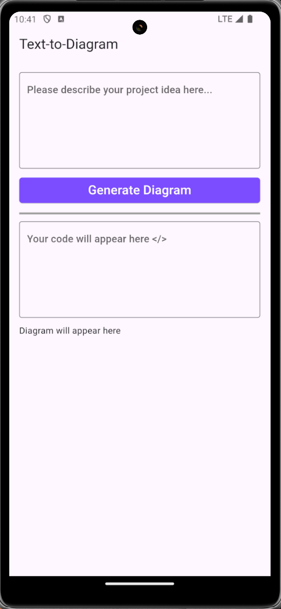
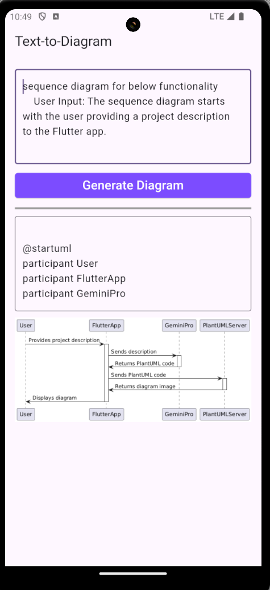
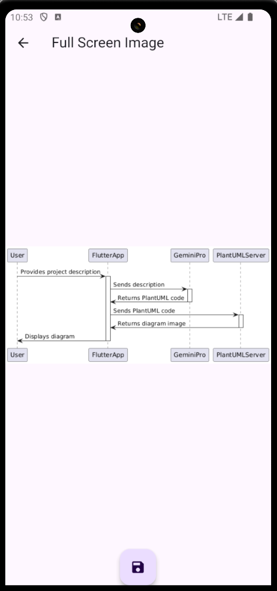

# Text-to-Diagram Flutter App

This Flutter application leverages the power of Google's Gemini Pro model to generate PlantUML diagrams from textual descriptions.  

## Demo Video

| | | |
|-|-|-|
|||

## Features

- **Simple and intuitive UI:** Easily input your project idea or system description.
- **AI-powered diagram generation:** The app uses Gemini Pro to translate your text into PlantUML code.
- **Diagram visualization:** View the generated diagram directly within the app.
- **Code display:** The app shows the generated PlantUML code, allowing for learning and modification.
- **Full-screen image viewing:** Tap on the generated diagram for a closer look.
- **Save images locally:** Download and store the generated diagrams on your device.

## How it works

1. **Describe your idea:** In the provided text field, enter a description of your project, system, or process. Be as specific or general as needed.
2. **Generate diagram:** Press the "Generate Diagram" button. The app sends your text to Google's Gemini Pro, which generates the corresponding PlantUML code.
3. **View and interact:** The app displays the generated PlantUML code and renders the diagram. Zoom and pan within the diagram view.
4. **Full-screen and saving:** Open the diagram in full-screen mode by tapping on it. Use the floating save button to download the image.

## Libraries Used

- **Flutter:** For building the user interface.
- **google_generative_ai:** To access and interact with Google's Gemini Pro model.
- **http:** To fetch the diagram image from the PlantUML server.
- **path_provider:** To access the device's storage for saving images.

## Potential Applications

- **Software design and documentation:** Quickly create UML diagrams for software projects.
- **System architecture visualization:** Generate diagrams to represent complex systems and their interactions.
- **Process flowcharts:** Easily create visual representations of workflows and processes.
- **Brainstorming and idea sharing:** Visualize concepts and ideas during brainstorming sessions.

## Future Improvements

- Implement more robust PlantUML validation.
- Allow users to edit the generated PlantUML code.
- Support for additional diagram types beyond PlantUML. 
- Enhancements to the user interface for improved usability.

## Getting Started

1. Clone this repository.
2. Make sure you have Flutter installed and set up.
3. Get a Google Cloud Platform account and an API key for the Gemini Pro model.
4. Replace the placeholder API key in the `home_screen.dart` file with your own key.
5. Run the app on an emulator or device.

## Download here 
[Text-To-Diagram](https://drive.google.com/file/d/1B6mgzHTbsW0tfIA8TSdPU2Cr30slfGhS/view?usp=sharing)

## Disclaimer

This project is for educational and demonstration purposes. The use of Google's Gemini Pro API is subject to Google Cloud Platform's terms of service and pricing. 
